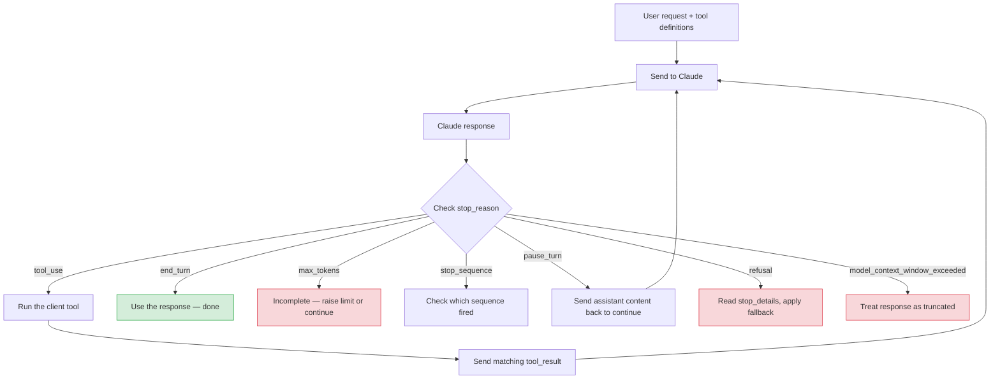

# Domain 1: Agentic Architecture and Orchestration

**Last refresh:** August 2026

## What this domain is really about

An agentic system lets Claude choose and use tools, inspect the results, and continue until the job is complete. Your application provides the tools and controls execution. Claude chooses when a tool is useful, but it does not run your client-side code by itself.

The main ideas are:

1. Run the agent loop correctly.
2. Pass complete context to subagents.
3. Use parallel work only when tasks are independent.
4. Enforce critical rules in code or hooks, not only in prompts.
5. Resume or fork sessions only when their saved context is still useful.

---

## 1. The agent loop

### Simple version

1. Send Claude the user's request and the available tool definitions.
2. Read Claude's response.
3. Check `stop_reason`.
4. If Claude requested a client tool, run it and send back a matching `tool_result`.
5. Repeat until Claude finishes or another stop condition requires handling.



### Important `stop_reason` values

| Value | Plain meaning | Typical application action |
|---|---|---|
| `end_turn` | Claude finished naturally. | Use the response. |
| `tool_use` | Claude wants a client tool to run. | Execute the tool and return its result. |
| `max_tokens` | The configured output-token limit was reached. | Treat the output as incomplete; increase the limit or continue carefully. |
| `stop_sequence` | Claude produced one of your configured stop strings. | Check which sequence fired. |
| `pause_turn` | A server-side tool loop reached its iteration limit. | Send the assistant content back so processing can continue. |
| `refusal` | Claude declined the request. | Read `stop_details` and follow the documented fallback behavior. |
| `model_context_window_exceeded` | The response filled the model context window. | Treat the response as truncated. |

### Key rule

Do not decide that the loop is finished merely because the response contains text. A response can include both explanatory text and one or more `tool_use` blocks.

### Client tools and server tools are different

- **Client tool:** Your application runs it. Claude returns a `tool_use` block, and your application sends back a `tool_result`.
- **Server tool:** Anthropic runs it on its infrastructure. Your application usually receives the result in the response rather than executing that tool itself.

### Returning tool results

Every client-tool result must use the exact ID of the tool request it answers.

```json
{
  "role": "user",
  "content": [
    {
      "type": "tool_result",
      "tool_use_id": "toolu_123",
      "content": "15 degrees Celsius and partly cloudy"
    }
  ]
}
```

If a tool fails, return the matching result with `is_error: true`.

```json
{
  "type": "tool_result",
  "tool_use_id": "toolu_123",
  "is_error": true,
  "content": "Weather service timed out"
}
```

When returning multiple results, put the `tool_result` blocks first in the user message. Do not insert another message between Claude's tool request and the matching results.

### Common wrong approaches

- Looking for phrases such as “I'm done.”
- Treating any text block as proof that the work is complete.
- Returning a result with the wrong `tool_use_id`.
- Using a fixed loop limit as the normal completion signal. A safety limit is sensible, but `stop_reason` still drives normal control flow.

---

## 2. Multi-agent orchestration

### Coordinator and subagents

A coordinator can divide a large task among specialized subagents, then combine their results.

```text
                 Coordinator
              /       |       \
         Research   Review   Synthesis
         subagent  subagent   subagent
```

A useful coordinator should:

- divide the task into clear pieces;
- send each piece to the right subagent;
- provide the context each subagent needs;
- collect and compare results;
- notice missing coverage or failures;
- request another focused pass when necessary.

### Context isolation

The current Claude Code tool reference describes the `Agent` tool as creating a subagent with its own context window. In practical terms, do not assume a subagent knows the main conversation. Give it the task, constraints, relevant facts, expected output, and source material it needs.

**Weak prompt**

```text
Review the customer's problem.
```

**Better prompt**

```text
Review order 67890. The customer reports that the item arrived damaged.
Check the supplied return-policy text and produce:
1. eligibility decision,
2. evidence used,
3. any missing information,
4. recommended next step.
Do not approve or issue a refund.
```

### Parallel versus sequential work

Use parallel delegation when tasks are independent, such as reviewing separate files or researching unrelated questions.

Use sequential work when a later task needs an earlier result. For example, first identify the failing database query, then ask a second agent to propose a fix for that specific query.

### Avoid narrow decomposition

A coordinator can miss important areas if it defines the task too narrowly. Add a coverage check before final synthesis:

- What parts of the original request were addressed?
- What parts are missing?
- Do sources disagree?
- Does another focused pass add value?

### Structured handoffs

Use a predictable structure so the next agent or a human reviewer can evaluate the work.

```json
{
  "summary": "Short conclusion",
  "findings": [
    {
      "claim": "What was found",
      "evidence": "Supporting passage or observation",
      "source": "Document or URL",
      "confidence": "high, medium, or low"
    }
  ],
  "open_questions": ["What still needs checking"],
  "recommended_next_step": "Suggested action"
}
```

This structure is a recommended design pattern, not a required Anthropic schema.

---

## 3. Enforcing workflow rules

### Prompt instruction versus programmatic enforcement

A prompt tells the model what it should do. A hook or application-level check can prevent a tool from running.

For low-risk preferences, prompt instructions may be enough. For sensitive actions, such as issuing refunds, deleting production data, or accessing restricted files, use programmatic controls and human approval where appropriate.

### Example: block a refund until verification

A `PreToolUse` hook can inspect an attempted tool call before execution and deny it when prerequisites are missing.

```json
{
  "hookSpecificOutput": {
    "hookEventName": "PreToolUse",
    "permissionDecision": "deny",
    "permissionDecisionReason": "Identity verification is incomplete"
  }
}
```

The documented decision values include `allow`, `deny`, and `ask`.

### Useful hook events

Anthropic's current hook reference lists many events. Learn what the event does rather than memorizing a total count, because the catalog can change.

| Event | When it is useful |
|---|---|
| `SessionStart` | Initialize or load session-specific context. |
| `UserPromptSubmit` | Inspect input before Claude processes it. |
| `PreToolUse` | Approve, deny, or modify a tool call before execution. |
| `PermissionRequest` | Handle a tool permission decision. |
| `PostToolUse` | React after a tool succeeds. |
| `PostToolUseFailure` | Handle a failed tool call. |
| `SubagentStart` | Observe the start of delegated work. |
| `SubagentStop` | React when delegated work finishes. |
| `PreCompact` | Act before context compaction. |
| `Stop` | React when Claude finishes responding. |
| `SessionEnd` | Clean up or record final session information. |

### Hook handler types

The current Claude Code hook reference documents command, HTTP, prompt, agent, and MCP-tool handlers. Choose based on the job:

- **command:** local shell validation or automation;
- **HTTP:** call an external service or logging endpoint;
- **prompt:** ask a model for a single judgment;
- **agent:** perform a more involved model-based check;
- **MCP tool:** call a configured MCP service.

Prompt and agent hooks still use model judgment. They are not equivalent to a deterministic code check.

### Hook settings locations

Common Claude Code settings locations include:

- `~/.claude/settings.json` for user-level settings;
- `.claude/settings.json` for project settings that can be shared;
- `.claude/settings.local.json` for local project overrides.

Organization-managed settings may also apply.

---

## 4. Task decomposition patterns

### Fixed prompt chain

Use a known sequence when the steps are predictable.

```text
Review each file
      ->
Check cross-file behavior
      ->
Write one final report
```

### Adaptive investigation

Use adaptive decomposition when each discovery determines the next step.

```text
Investigate slow endpoint
      -> database calls dominate
Inspect query pattern
      -> repeated per-row query found
Design and test a targeted fix
```

### Multi-pass review

For a large change, a practical review design is:

1. local review of individual files;
2. cross-file review of interfaces and data flow;
3. final deduplication and prioritization.

This is a recommended review strategy, not an Anthropic API requirement.

---

## 5. Session management

### Continue, resume, and fork

Current Anthropic documentation distinguishes these concepts:

- **Continue:** pick up the most recent session in the current directory.
- **Resume:** pick a specific saved session by name or ID.
- **Fork:** branch from an existing session so you can try a different approach without changing the original conversation.

A saved session includes conversation history, tool calls, tool results, and responses. It does **not** act as a filesystem snapshot. If files or services changed, tell Claude what changed and ask it to read or verify the current state again.

### When to resume

Resume when earlier context and tool results are still relevant.

Start fresh, or fork and re-check, when:

- the task has changed substantially;
- prior results may be stale;
- the conversation has accumulated irrelevant context;
- you want to compare independent approaches.

---

## Practice questions

### Question 1

Claude's response contains explanatory text and a client-tool request. What should your loop do next?

A. End because text was produced  
B. Run the requested tool and return a matching result  
C. Delete the text block and retry  
D. Start a new session

**Answer: B.** A response may contain text and a `tool_use` block. The application should follow `stop_reason` and handle the tool call.

### Question 2

A coordinator asks a subagent to review a customer issue. Which prompt is best?

A. “Handle it using the context you already know.”  
B. “Review the issue,” with no other information  
C. A prompt containing the relevant facts, constraints, source material, and expected output  
D. A prompt containing only the customer's name

**Answer: C.** A subagent has its own context window, so it needs complete task-relevant information.

### Question 3

A refund action must be blocked unless verification has succeeded. Which design provides the strongest control?

A. Mention verification in a friendly reminder  
B. Add more examples to the system prompt  
C. Use a `PreToolUse` hook or application check that denies the refund call  
D. Increase temperature

**Answer: C.** Sensitive prerequisites should be enforced before the tool executes.

### Question 4

Claude requests two independent client tools in one response. What is the correct reply pattern?

A. Return one `tool_result` for each request, using the matching IDs  
B. Return one combined result with no IDs  
C. Reply as the assistant  
D. Ignore the second request

**Answer: A.** Each result must correspond to its `tool_use_id`.

### Question 5

When is parallel delegation most appropriate?

A. When the second task needs the first task's result  
B. When tasks are independent and can safely run at the same time  
C. Whenever the prompt is long  
D. Only when all agents use identical tools

**Answer: B.** Dependent tasks should usually be sequenced.

### Question 6

What does resuming a session restore?

A. A guaranteed copy of the old filesystem  
B. Conversation history, including prior tool calls and results  
C. Only the last answer  
D. Deleted project files

**Answer: B.** Session history and filesystem state are separate.

### Question 7

A client tool times out. How should the application report the failure?

A. Omit the result  
B. Return a matching `tool_result` with `is_error: true`  
C. Change the response's `stop_reason`  
D. Reuse an unrelated tool-call ID

**Answer: B.** The error flag tells Claude that execution failed while preserving the call-result link.

### Question 8

Which statement about `pause_turn` is correct?

A. It always means the user cancelled the request  
B. It indicates a server-tool loop reached its iteration limit and can be continued by sending the assistant content back  
C. It means the client tool succeeded  
D. It is another name for `end_turn`

**Answer: B.** This is the handling described in Anthropic's stop-reason documentation.

### Question 9

Which statement best describes a prompt-based hook?

A. It is always deterministic  
B. It uses model judgment for a decision  
C. It cannot inspect context  
D. It is the only way to block a tool

**Answer: B.** Use deterministic code checks for rules that must never be bypassed.

### Question 10

Why should a coordinator perform a coverage check before final synthesis?

A. To make every task slower  
B. To ensure no important part of the original request was missed  
C. To force every subagent to use all tools  
D. To avoid citing evidence

**Answer: B.** Coverage checks reduce gaps caused by overly narrow decomposition.

---

## Official Anthropic references checked

- [Stop reasons and fallback](https://platform.claude.com/docs/en/build-with-claude/handling-stop-reasons)
- [Tool use with Claude](https://platform.claude.com/docs/en/agents-and-tools/tool-use/overview)
- [Handle tool calls](https://platform.claude.com/docs/en/agents-and-tools/tool-use/handle-tool-calls)
- [Hooks reference](https://code.claude.com/docs/en/hooks)
- [Claude Agent SDK hooks](https://code.claude.com/docs/en/agent-sdk/hooks)
- [Claude Code tools reference](https://code.claude.com/docs/en/tools-reference)
- [Agent SDK sessions](https://code.claude.com/docs/en/agent-sdk/sessions)
- [Claude Code session management](https://code.claude.com/docs/en/sessions)

> Product documentation changes quickly. Recheck these official pages shortly before taking an exam.
